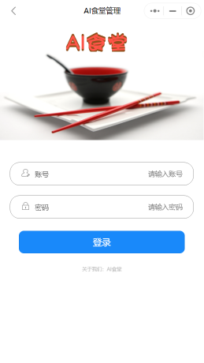
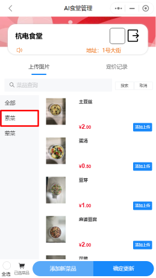
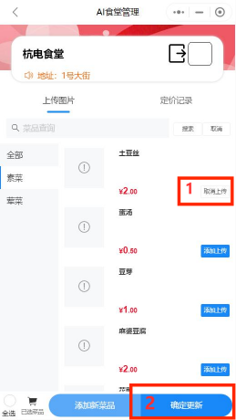
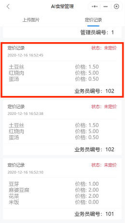
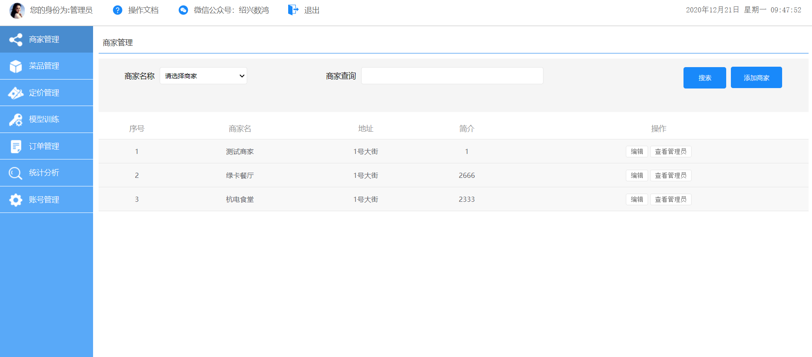

## 3.1 系统使用者说明

| 系统的使用者 | 说明                           |
| ------------ | ------------------------------ |
| 小程序       | 具体商家的管理员和业务员       |
| 后端平台     | 商家管理员，参与整个平台的维护 |
| 应用端       | 用餐人员(由食堂工作人员监管)   |

## 3.2 AI智慧食堂微信小程序

### 业务员操作步骤

#### 3.2.1 步骤一：业务员登录（业务员）

小程序登录页面如图 。 

#### 3.2.2 步骤二：菜品新增（业务员）

左侧选中某一个菜品类型，如下图选中“凉菜”  。

点击下方添加新菜品。

#### **3.2.3** 步骤三：菜品编辑（业务员）

可对新增的、已存在的菜品进行编辑，如图输入菜名与价格，可选择“+”或者“相机”进行添加图片，每次都要完整拍到底部餐盘。  

#### 3.2.4 步骤四：菜品上传（业务员）

框 1 处可选中需要更新菜品信息。  

上图的框 2 处可以确定更新，即菜品上传，并会生成相应的记录。

### 管理员操作步骤

#### **3.2.5** 步骤一：登录（管理员）

管理员登录账号为1，密码为 001。

#### 3.2.6 步骤二：菜品定价（管理员）

管理员可对未定价的记录进行定价。

#### 3.2.7 步骤三：菜品训练（管理员）

管理员定价之后的对应定价记录状态变更为“开始训练”，点击该按钮即可进行菜品训练，之后等待训练完成（达 100%）即可。  

## 3.3 AI智慧食堂服务后台

#### 3.3.1 管理员登陆

管理员输入账号，密码和验证码后可登录。

#### 3.3.2 商家管理

可选择或名称查询到已入驻的商家相关的信息。

#### 3.3.3 菜品管理

可通过名称查询已完成的菜品相关信息。

#### 3.3.4 定价管理

可通过名称、时间区间等查询已定价的记录信息。

#### 3.3.5 模型训练

可查看已训练的记录信息。

#### 3.3.6 订单管理

可通过名称、时间区间等查询到应用端订单信息。

#### 3.3.7 统计分析

可查看到目前为止 30 天内的商家销售额和订单数。

#### 3.3.8 账号管理

对普通用户的密码进行修改等操作。

## 3.4 AI智慧食堂应用端

在有菜品训练更新的情况下，在识别一体机上需更新数据，启动如下图所示的快捷方式等待下载更新即可。

#### 3.4.1 步骤一：菜品识别

应用端识别场景主要设备包含：高拍仪、显示器。

识别、支付界面

#### 3.4.2 步骤二：订单支付

可选择支付宝，微信，银行卡三种支付方式进行支付。至此完成用户就餐支付的过程。